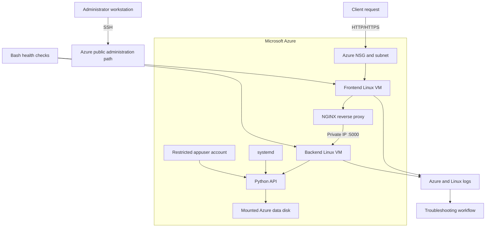

# Azure Linux Cloud Engineer Lab

A hands-on cloud operations project focused on building, administering, and troubleshooting a two-tier Linux workload in Microsoft Azure.

The lab follows a request from the public edge through Azure networking, NGINX, a private backend service, and persistent storage. Each phase will add configuration, command output, screenshots, and incident evidence as the environment is built and validated.

## Project objectives

- Build an isolated Azure network with two Linux virtual machines.
- Administer Linux users, groups, ownership, permissions, and restricted service identities.
- Deploy a small Python API and operate it as a managed `systemd` service.
- Configure NGINX as a reverse proxy to a backend reachable over private networking.
- Attach, format, mount, and persist an Azure data disk.
- Troubleshoot failures across Azure, Linux, network, service, application, and storage layers.
- Standardize health checks and recovery steps with Bash and operational runbooks.

## Target architecture



See [Architecture](architecture/architecture.md) for the traffic path, host roles, and Azure-versus-Linux responsibility boundaries.

## Build roadmap

| Phase | Focus | Validation evidence |
|---|---|---|
| 1 | Azure resource group, VNet, subnet, NSG, and two Linux VMs | Resource inventory, private addressing, NSG rules, SSH access |
| 2 | Linux identities and permissions | Human user, restricted service account, group membership, ownership, and mode checks |
| 3 | Python application deployment | Package installation, virtual environment, API process, and `curl` health tests |
| 4 | `systemd` service management | Start, stop, restart, enable, logs, and reboot persistence |
| 5 | NGINX and private request routing | Listener checks, reverse proxy configuration, backend reachability, and end-to-end response |
| 6 | Azure disk and Linux filesystem operations | Block-device discovery, filesystem creation, mount point, `/etc/fstab`, and reboot validation |
| 7 | Layered incident troubleshooting | Service, permission, network, proxy, storage, and resource-failure investigations |
| 8 | Bash automation and operational handoff | Repeatable server health check and application-unavailable runbook |

## Planned technology

`Microsoft Azure` · `Linux` · `Ubuntu Server` · `Azure Virtual Network` · `Network Security Groups` · `SSH` · `NGINX` · `Python` · `Flask` · `systemd` · `Bash` · `Azure Managed Disks`

## Repository guide

- [Architecture](architecture/architecture.md) — target design, request path, and responsibility boundaries
- [`app/`](app/) — Python application and dependency documentation
- [`config/nginx/`](config/nginx/) — reverse-proxy configuration
- [`config/systemd/`](config/systemd/) — managed application service unit
- [`runbooks/`](runbooks/) — repeatable build, deployment, storage, and recovery procedures
- [`incidents/`](incidents/) — evidence-based troubleshooting records
- [`scripts/`](scripts/) — Bash health checks and operational automation
- [Screenshot evidence](screenshots/README.md) — indexed validation screenshots
- [Lessons learned](lessons-learned.md) — technical and operational takeaways

## Troubleshooting method

```text
Observe the symptom
→ identify the affected layer
→ collect evidence
→ eliminate healthy dependencies
→ make the smallest safe correction
→ retest the original user path
→ document root cause and prevention
```

The goal is to distinguish Azure control-plane issues from Linux guest configuration, network reachability, service state, application behavior, and storage health instead of treating every outage as the same problem.

## Evidence standard

Screenshots and incident records will be added only after each configuration or test is performed. Evidence should show the command or Azure view, the relevant result, and enough context to explain what was validated without exposing credentials or private keys.
