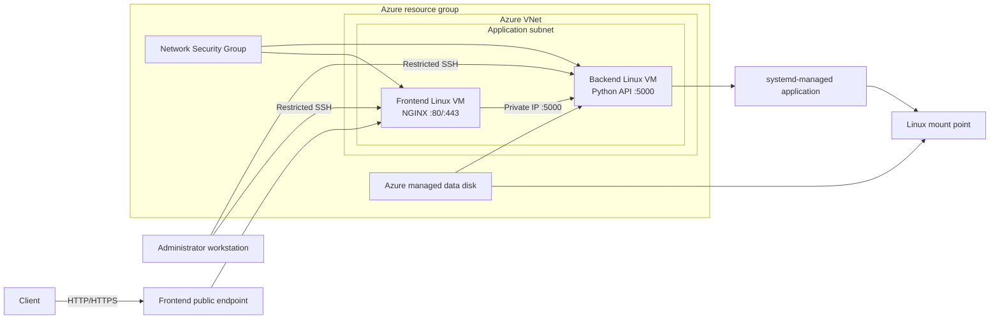

# Azure Linux Lab Architecture

## Target design



## Host roles

| Component | Planned responsibility |
|---|---|
| Frontend Linux VM | Accept client traffic, terminate the public request path, and reverse proxy to the backend |
| Backend Linux VM | Run the Python API as a restricted service identity under `systemd` |
| Azure VNet and subnet | Provide address space and private communication between the VMs |
| Network Security Group | Allow only required administrative and application traffic |
| Azure managed disk | Provide persistent application data storage to the backend VM |
| Administrator workstation | Perform SSH administration and external validation |

## Request path

```text
Client
→ Azure network controls
→ frontend VM
→ NGINX listener
→ backend private IP and port
→ systemd-managed Python process
→ application response or persistent data
```

Each arrow is a separate troubleshooting boundary. A successful VM deployment does not prove that SSH is allowed, a listening service does not prove that the NSG permits traffic, and a healthy backend does not prove that NGINX is routing to the correct address.

## Responsibility boundaries

| Azure controls | Linux controls |
|---|---|
| Resource placement and lifecycle | Users, groups, and `sudo` access |
| VNet, subnet, and private IP assignment | File ownership and permissions |
| NSG filtering | Local listeners and firewall behavior |
| Managed disk attachment | Partitioning, filesystems, mounts, and `/etc/fstab` |
| VM power and platform health | Packages, processes, services, and logs |

## Security intent

- Restrict SSH to the administrative source required for the lab.
- Expose only the frontend service to client traffic.
- Keep the backend application on private addressing.
- Run the application as a dedicated non-root service account.
- Grant filesystem permissions to the minimum identities that require them.
- Keep private keys, passwords, tokens, and local environment files out of source control.
